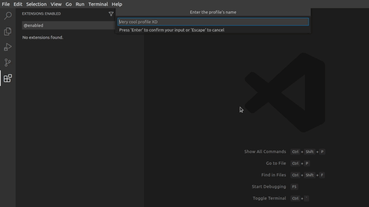
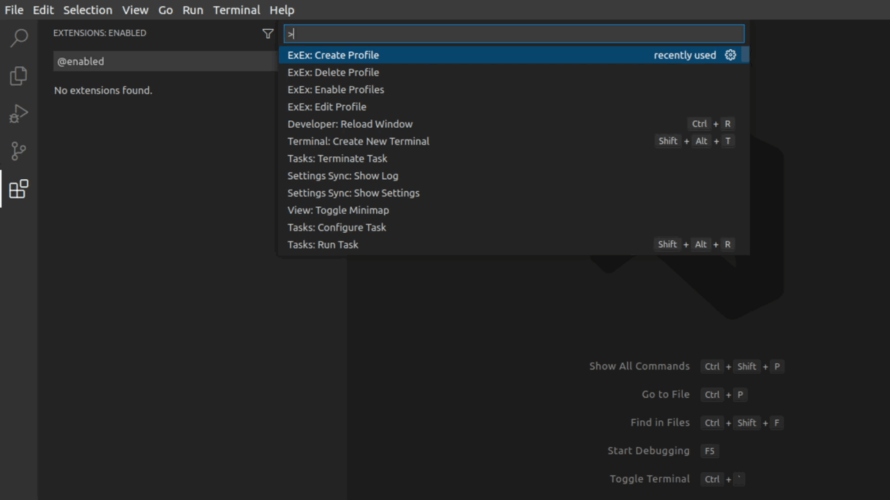

# ExEx
An extestion for managing extensions.

Table of Contents:
- [ExEx](#exex)
  - [Features](#features)
  - [Commands](#commands)
  - [Known Issues](#known-issues)
  - [Future features](#future-features)
  - [Release Notes](#release-notes)

## Features
- ### Create profiles of extensions that you want enabled and disabled for your current workspace

- ### Enable many profiles at a time

- ### Edit profiles

- ### Delete them

## Commands
- `xx.createProfile` - Create a profile.
- `xx.enableProfile` - Enable profiles *(leave no profiles selected to disable all extensions)*.
- `xx.deleteProfile` - Delete a profile.
- `xx.editProfile` - Edit a profile *(chage what extension to enable/disable)*.

## Known Issues
No known issues

## Future features
Theese are some of my ideas for the future:
- Rename a profile
- Merge profiles
- Syncing with settings
- Import/export a profile
- Auto-update profiles when changes are made
If you want, feel free to open a pull request if you want to contribute.

## Release Notes
Check out [CHANGELOG](CHANGELOG.md) for changes in each version.

